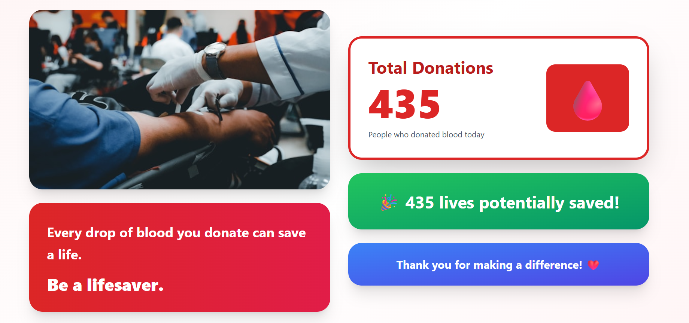
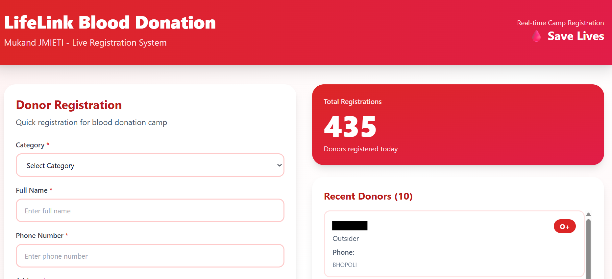

# 🩸 LifeLink - Blood Donation Dashboard

Real-time blood donation statistics display for college blood donation camps.

## 🌟 Live Demo

- **📊 Public Dashboard:** [https://jmieti-blood.vercel.app](https://jmieti-blood.vercel.app)
- **📝 Registration Portal:** [https://jmieti-registration.vercel.app](https://jmieti-registration.vercel.app)

## ✨ Features

- 📊 Real-time donation statistics
- 🔄 Auto-refresh every 3 seconds
- 📱 Fully responsive (mobile, tablet, desktop)
- 🎨 Clean, professional UI
- ⚡ Lightning-fast performance
- 💰 Zero operational cost

## 🛠️ Built With

- **React.js** - Frontend framework
- **Vite** - Build tool
- **Tailwind CSS** - Styling
- **Google Sheets** - Database
- **Vercel** - Deployment

## 📸 Screenshots

### Dashboard View


### Registration View


## 🚀 Quick Start

### Prerequisites
- Node.js 16+
- npm or yarn

### Installation

1. Clone the repository
```bash
git clone https://github.com/VanshRana1232/blood-donation-dashboard.git
cd blood-donation-dashboard
```

2. Install dependencies
```bash
npm install
```

3. Create `.env` file
```env
VITE_APPS_SCRIPT_URL=your_apps_script_url_here
```

4. Run development server
```bash
npm run dev
```

5. Open [http://localhost:5173](http://localhost:5173)

## 📦 Build for Production
```bash
npm run build
```

## 💡 How It Works

1. Data is stored in Google Sheets
2. Google Apps Script serves as API
3. Dashboard fetches and displays data
4. Auto-refreshes every 3 seconds for live updates

## 📊 Project Structure
```
blood-donation-dashboard/
├── src/
│   ├── main.jsx       # Main component
│   ├── api.js         # API integration
│   └── index.css      # Styles
├── public/
├── .env.example       # Environment template
└── README.md
```

## 🤝 Related Projects

**Registration Portal:** [LifeLink Registration](https://github.com/VanshRana1232/lifelink-registration)

## 👤 Author

**Vansh Partap Singh**
- GitHub: [@VanshRana1232](https://github.com/VanshRana1232)
- LinkedIn: [Vansh Partap Singh](https://www.linkedin.com/in/vansh-partap-singh-9069b7284/)
- Email: vanshrana1237@gmail.com

## 📄 License

MIT License - feel free to use this project!

## 🙏 Acknowledgments

- Built for Mukand JMIETI Blood Donation Camp
- Helping save lives through technology

---

⭐ **Star this repo if you found it helpful!**

🩸 **Making a difference, one line of code at a time!**